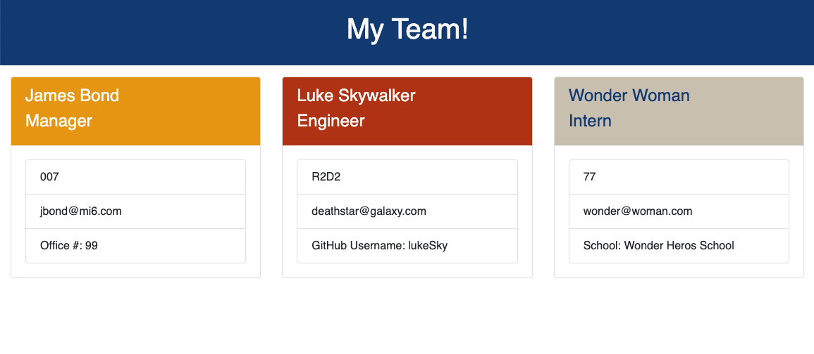

# Team Profile Generator

## Description
A command line application where the user will be prompted for team members and their information. When the information has been obtained, an HTML file is generated that displays the team in a nicely formatted team roster. When an email address is clicked the default email program opens and populates the to field with the email address, when the github username is clicked then the github profile opens in a new tab. 

***
## Table of Contents
[Installation](#installation) 
[Usage](#usage) 
[Contributing](#contributing) 
[Tests](#tests) 
[License](#license) 
[Questions](#questions) 
***
## Installation
The application starting point is node index.js. 

## Usage
The user will be prompted to enter the team mananger's name, employee id, email address and office number. When the engineer option is chosen the user will be prompted to enter the engineers information and the same for intern if the intern option is chosen. When all team members have been entered the HTML roster will be created. 

https://drive.google.com/file/d/1kPXSjJSKvN5DNKc4NB--GZY-I9vboTGA/view

## Contributing

## Tests
Tests using Jest npm have been performed on this application. 

## License
### This license is covered under the GNU license(s):
* The GNU General Public License (GNU GPL or simply GPL) is a series of widely-used free software licenses that guarantee end users the freedom to run, study, share, and modify the software.
***
## Questions
For more information contact me at: 
* Name: aksmith5239
* GitHub: https://github.com/aksmith5239/team-profile-generator/settings
* Email Address: aklobby@gmail.com
    